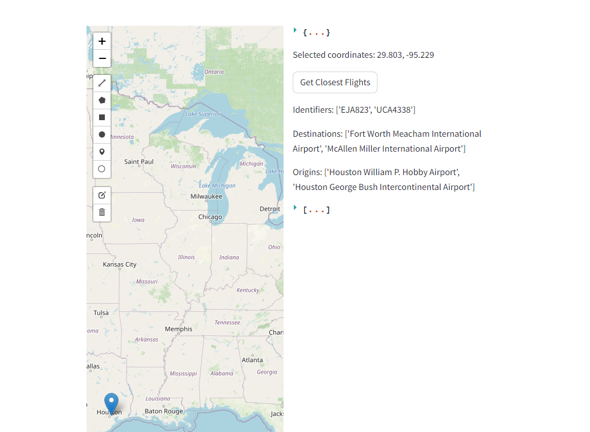
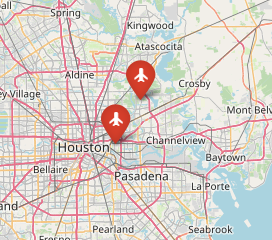

## SkyGuess
**How many times when you see an airplane you think to yourself, where is it headed?**

## Description
In this repo we try to solve that mistery.  
We will be using Flightradar24 API and streamlit to emulate a game where we can guess and answer the position of an airplane.  

## Usage
```bash
streamlit run main.py
```


## How it works
We get a latitude and longitude from a point in the map, fitting EPSG:4326. .
For example in this instance we select a point near houston:

We then retrieve all flights in a specific radius.  
You can select to search for the closest flights, or to the closest flight to a specific cardinality.
By default we work with the 2 closest. And we plot them on the map.


## Aknowledgements
The API calls are done with a modification of https://pypi.org/project/FlightRadarAPI/:
```
FlightRadarAPI
Unofficial API for FlightRadar24 written in Python 3.

If you want to use the data collected using this API commercially, you need to subscribe to the Business plan.

```
See more information at: https://www.flightradar24.com/terms-and-conditions